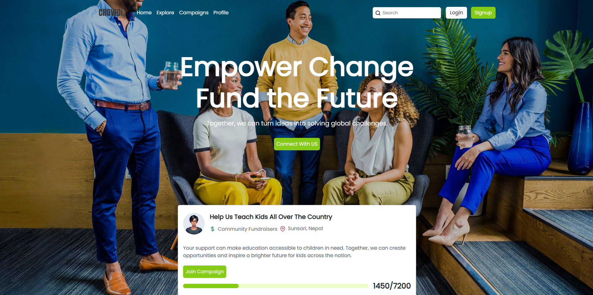

<h1>
  👨‍💻 About Me
</h1>

<ul>
  <li>Undergraduate Student</li>
  <li>I’m currently Exploring Web Development in Depth</li>
  <li>I love exploring cybersecurity threats in free time</li>
  <li>Languages: Nepali, English</li>
</ul>

<h1 align="left">💻 Languages and Tools</h1>
<table>
  <tr align="center">
    <td>
      
    </td>
    <td>
      
    </td>
    <td>
      
    </td>
    <td>
      
    </td>
    <td>
      
    </td>
    <td>
      
    </td>
    <td>
      
    </td>
    <td>
      
    </td>
  </tr>
  <tr>
    <td>
      
    </td>
    <td>
          
    </td>
    <td>
      
    </td>
    <td>
      
    </td>
    <td>
      
    </td>
    <td>
      
    </td>
    <td>
      
    </td>
    <td>
      
    </td>    
  </tr>
</table>

<!-- <h2 align="left">Projects</h2> -->
<!-- <table>
  <tr>
    <td>
      
    </td>
    <td>
      <h3>Crowdi</h3>
      
A Crowd Funding FullStack Platform.

    </td>
  </tr>
</table> -->

 

